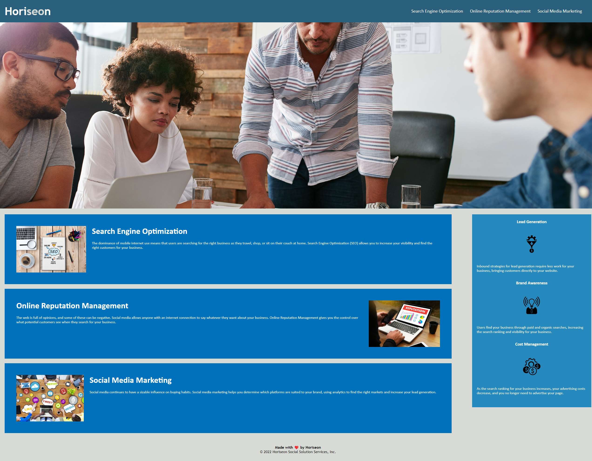

# Horiseon-Refractor

## Description

The motivation and purpose behind this was to create a more accessible site for the Horiseon company. The changes made fixes the issues of the images not having alternative texts, as well as streamlining the code for maximum efficancy. I learned a lot about properly organizing and labeling code, as well as changing the applicable css.

## Usage

## Credits

[W3School](https://www.w3schools.com/) was used for the HTML semantic elements.

## License

MIT License- A short and simple permissive license with conditions only requiring preservation of copyright and license notices. Licensed works, modifications, and larger works may be distributed under different terms and without source code.